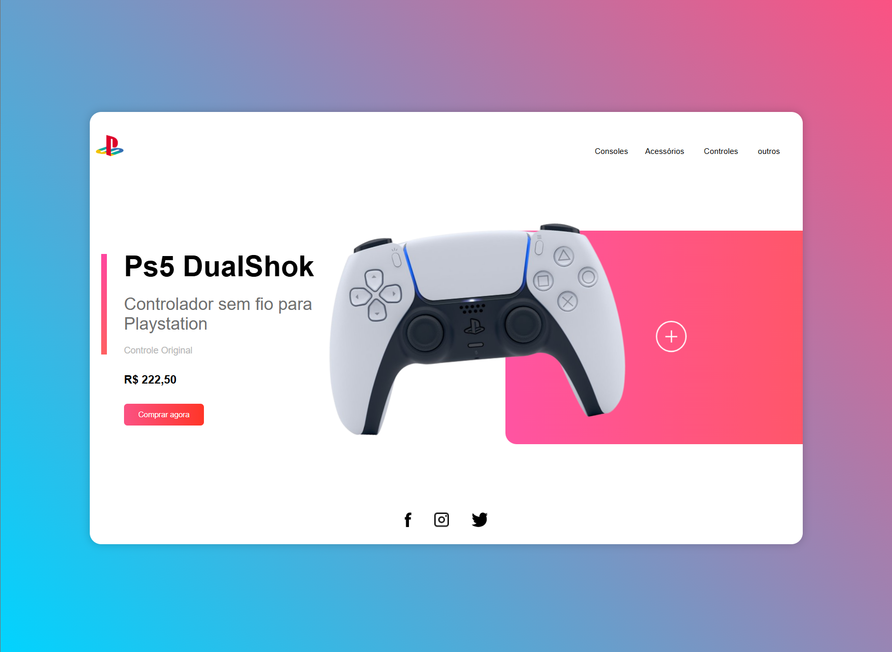
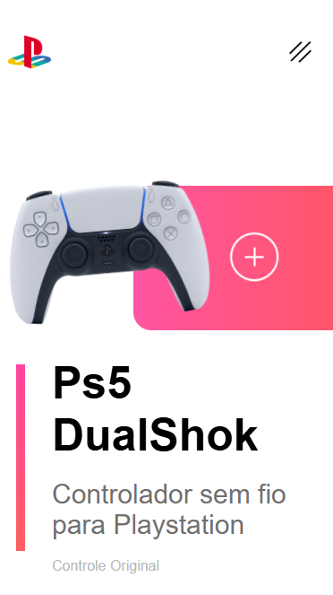

# 📝 Playstation Store - Landing Page Concept

Uma landing page conceitual inspirada na identidade visual da Playstation, focada em demonstrar habilidades de front-end com HTML5, CSS3 e JavaScript puro, apresentando animações fluidas e design totalmente responsivo.

## 🌐 Versão Web


## 📱 Versão Mobile


## 🎨 Demonstração

O projeto apresenta um design moderno e focado em UI/UX com:
- Fundo Dinâmico: Gradiente elegante (azul para rosa/violeta) que remete à marca.
- Interatividade: Botão de compra que expande e revela ícones ao passar o mouse.
- Animações Suaves: O controle flutua na tela usando @keyframes, dando vida à interface.
- Menu Mobile: Sistema de "toggle" funcional para navegação em telas pequenas.
- Layout Responsivo: Adaptação completa de elementos para desktop, tablets e smartphones.

## 🚀 Tecnologias Utilizadas

- **HTML5** - Estrutura semântica e organizada.
- **CSS3** - Estilização avançada com:
  - Flexbox: Para alinhamento e distribuição de elementos.
  - Animações Customizadas: Movimentação fluida de elementos visuais.
  - Media Queries: Garantindo a responsividade em todos os dispositivos.
- **JavaScript ES6+**
  - Manipulação do DOM para o menu responsivo.
  - Lógica de transição de estilos via JS.

## 📁 Estrutura de Arquivos

```
├── index.html
├── style.css
├── script.js
├── public/
│   ├── mobile.png
│   └── web.png
├── LICENSE
└── README.md
```

## ✨ Funcionalidades

### Interface Principal
- ✅ **Animação do Produto** - Efeito de flutuação no DualShock 5.
- ✅ **Botão Interativo** - ransição de largura e visibilidade de ícones no hover.
- ✅ **Seção de Social Media** - Links integrados com ícones de redes sociais.


### Navegação e Responsividade
- ✅ **Menu Sanduíche** - Implementado para telas menores que 760px.
- ✅ **Ajuste de Fluxo** - Inversão de colunas em dispositivos móveis para melhor leitura.
- ✅ **Tipografia Otimizada** - Uso da fonte Google Fonts (Roboto) para legibilidade.


## 📝 Licença

Este projeto está licenciado sob a [Licença MIT](https://github.com/Rodrigopcosta/Playstation-store-concept-landing-page/blob/main/LICENSE).

## 👤 Autor

Desenvolvido por Rodrigo Costa com dedicação e atenção aos detalhes!
